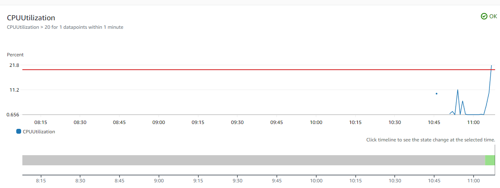

# EC2 CPU utilization

1. Open the CloudWatch console at https://console.aws.amazon.com/cloudwatch/.

2. In the navigation pane, choose Alarms, All Alarms.

3. Choose Create alarm.

4. Choose Select metric.

5. In the All metrics tab, choose EC2 metrics.

6. Choose a metric category (for example, Per-Instance Metrics).

7. Find the row with the instance that you want listed in the InstanceId column and CPUUtilization in the Metric Name column. Select the check box next to this row, and choose Select metric.

8. Under Specify metric and conditions, for Statistic choose Average, choose one of the predefined percentiles, or specify a custom percentile (for example, p95.45).

9. Choose a period (for example, 5 minutes).

10. Under Conditions, specify the following:

11. For Threshold type, choose Static.

12. For Whenever CPUUtilization is, specify Greater. Under than..., specify the threshold that is to trigger the alarm to go to ALARM state if the CPU utilization exceeds this percentage. For example, 70.

13. Choose Additional configuration. For Datapoints to alarm, specify how many evaluation periods (data points) must be in the ALARM state to trigger the alarm. If the two values here match, you create an alarm that goes to ALARM state if that many consecutive periods are breaching.

14. To create an M out of N alarm, specify a lower number for the first value than you specify for the second value. For more information, see Evaluating an alarm.

15.For Missing data treatment, choose how to have the alarm behave when some data points are missing. For more information, see Configuring how CloudWatch alarms treat missing data.

15. If the alarm uses a percentile as the monitored statistic, a Percentiles with low samples box appears. Use it to choose whether to evaluate or ignore cases with low sample rates. If you choose ignore (maintain alarm state), the current alarm state is always maintained when the sample size is too low. For more information, see Percentile-based CloudWatch alarms and low data samples.

16. Choose Next.

17. Under Notification, choose In alarm and select an SNS topic to notify when the alarm is in ALARM state

18. To have the alarm send multiple notifications for the same alarm state or for different alarm states, choose Add notification.

19. To have the alarm not send notifications, choose Remove.

20. When finished, choose Next.

21. Enter a name and description for the alarm. Then choose Next.

22. The name must contain only UTF-8 characters, and can't contain ASCII control characters. The description can include markdown formatting, which is displayed only in the alarm Details tab in the CloudWatch console. The markdown can be useful to add links to runbooks or other internal resources.

23. Under Preview and create, confirm that the information and conditions are what you want, then choose Create alarm.

# Alarm

## For the alarm created the threshold of CPU Utilazation was set to 20

## When this threshold was breached i recieved an email.

