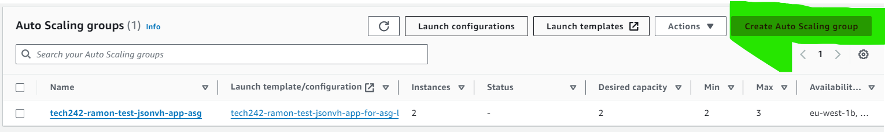
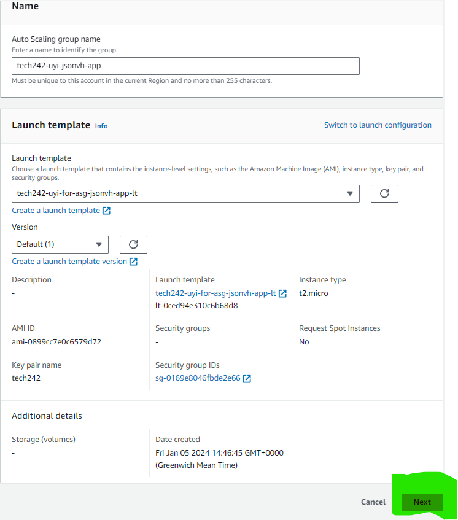
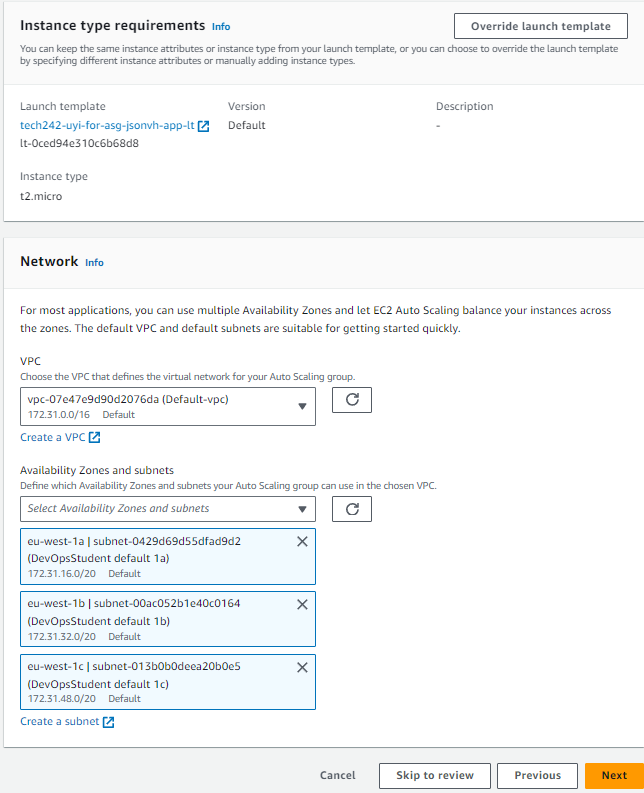
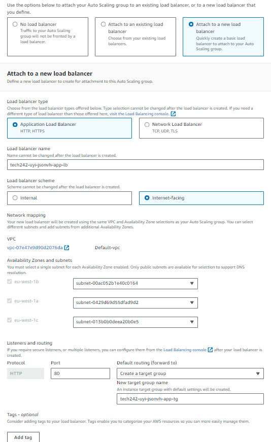
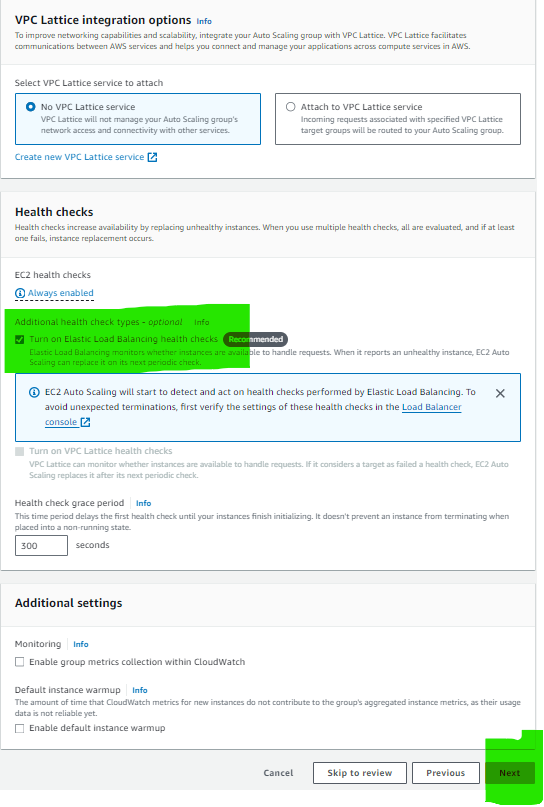
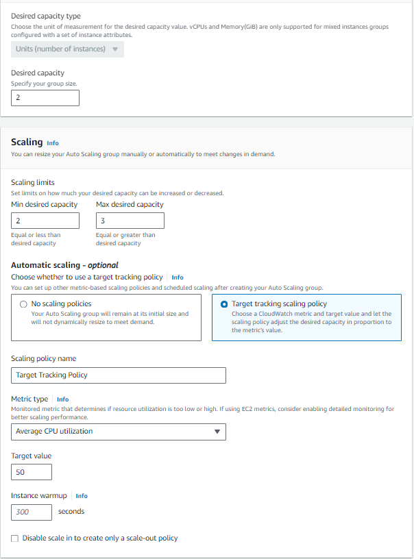
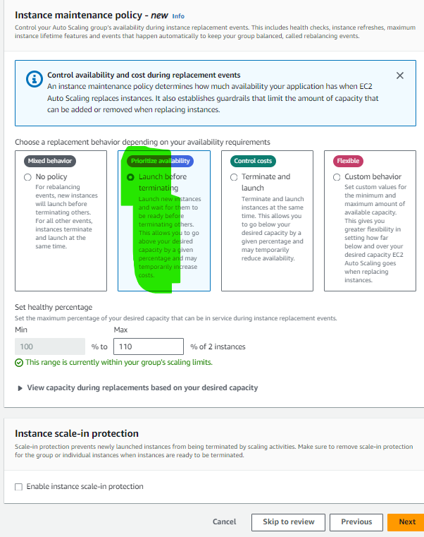
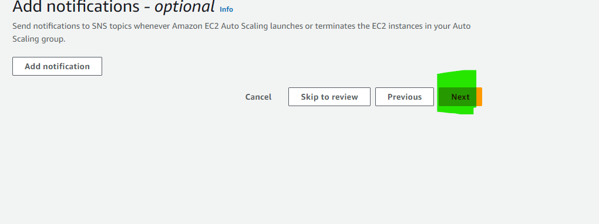
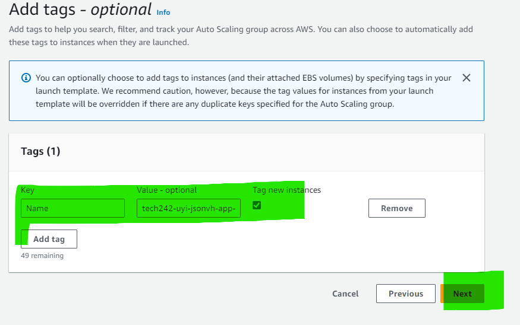

# Auto Scaling

AWS horizontal: More of the same Virtual Machine.

AWS Vertical: increase the size of the Virtual Machine.

# Steps

1. Start with VM
2. Create AMI(Copy of the disk)
3. Launch Template
4. Auto Scaling Group
   1. Scaling policy
   2. Metrics to use (Average CPU utilization)
5. Create the VMs (in Ireland Region but different availability zones)

load balancer and target group need to be deleted after ASG also

### 1. Create Auto Scaling Group

- Description: Set the name for your Auto Scaling Group

### 2. Setup Availability Zones

- Description: Set up availability zones in 1a, 1b, 1c (DevOpsStudent default)

### 3. Add a Load Balancer

- Description: Application load balancer and make it Internet Facing

### 4. Turn on Elastic Load Balancing

- Description: Allow for Elastic load balancing 

### 5. Instance Scaling

- Description: Define how many instances is you desired, minimun and maximum

### 6. Scaling Policy

- Description: Set your Scaling policy

### 7. Notifications

- Description: For this case I left the notifications blank

### 8. Add tags

- Description: Add additional tag