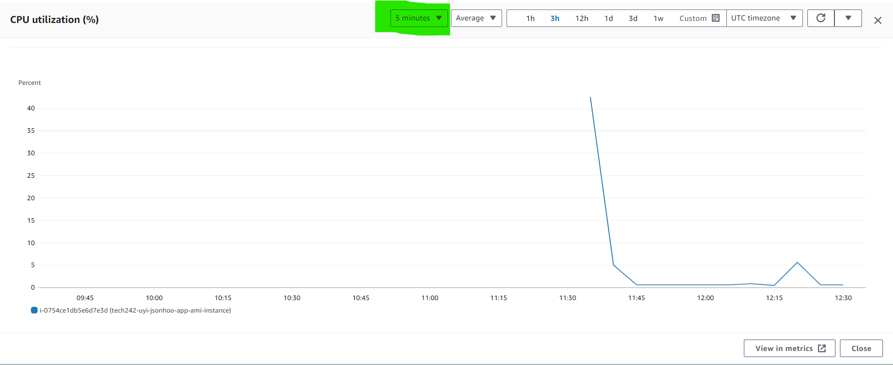

# Monitoring

## Why we need monitoring

Load testing: needs testiung to see where the cpu/vm starts to fail for the end users

Alarm: when something goes wrong with the system someone (the right person) needs to be notified.

### Situations

Worst case: no monitoring

app is running -> lots of traffic suddenly -> CPU load too high -> VM falls over!

Better Case: CW

App is running -> CloudWatch Monitoring -> CPU load -> Dashboard -> 

Better Case: CW + Alerts

App is running -> CloudWatch Monitoring -> Alarm System -> Notification

Best Case: Automatic Response

App is running -> CloudWatch Monitoring -> Autoscaling

## Drawn Diagram

## EC2 Monitoring

## Graph

