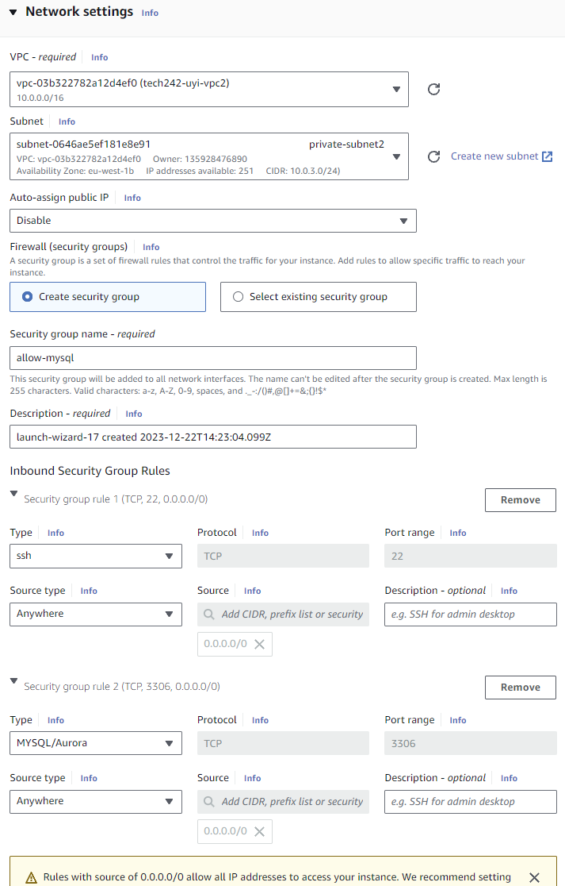

# What is a Virtual Public Cloud (VPCS)

**Definition:** A Virtual Public Cloud

**Availability Zone:** A Data Center

A VPC is a building/network shared with everyone else. Using the public cloud, a VPC is like an apartment in this building, with default subnets associated with availability zones representing the rooms in the apartment (3 for Ireland).

**Custom VPC:** Can be used to set public and private subnets.

- Public subnet = App/Api
- Private subnet = Database

TCP/IP Network: Every device needs an IP address. The IP address range is decided using a CIDR block (10.0.0.0), and subnet masks are not needed.

- 10.0.0.0/16: First two values/numbers are locked, so change the last two.
- 10.0.2.0/24: Public subnet
- 10.0.3.0/24: Private subnet

By default, when you set up a VPC, there is a router that handles the routing for your network. It uses a default route table that only allows routing within your VPC.

We need to create a new route table to allow requests from the outside (Internet Gateway, a door from inside VPC to out).

To come inside from the internet:

1. Public IP address to the Internet Gateway
2. Routed to the subnet
3. Then to the VM

**Traffic:**
- Insecure (outside VPC)
- Secure (within VPC)

**Create:**
1. VPC
2. Subnets
3. Internet Gateway
   - Attach to the VPC
4. Create route table
5. Associate table with subnet
6. Associate table with Internet Gateway
7. Check VPC setup correctly

## AWS Method:

1. Search for VPC in AWS
   

2. Create VPC
   

   

3. Subnets

4.  Create subnet
   
   

5.  Internet Gateway

   

6.  Internet Gateway fill
    
   

7.  Attach Gateway to VPC
    
   

8.  Attach to VPC fill
    
   

9.  Create Routes
    
   

10. Route fill
    
   

11. Associate route with public subnet
    
   

12. Associate fill
    
   

13. Associate route with IGW
    
   

14. Associate route with IGW fill
    
   

15. Check VPC
    
   

Create DB VM with VPC

Create App VM with VPC

Can't use VPC with old security group, so we have to create a new one.