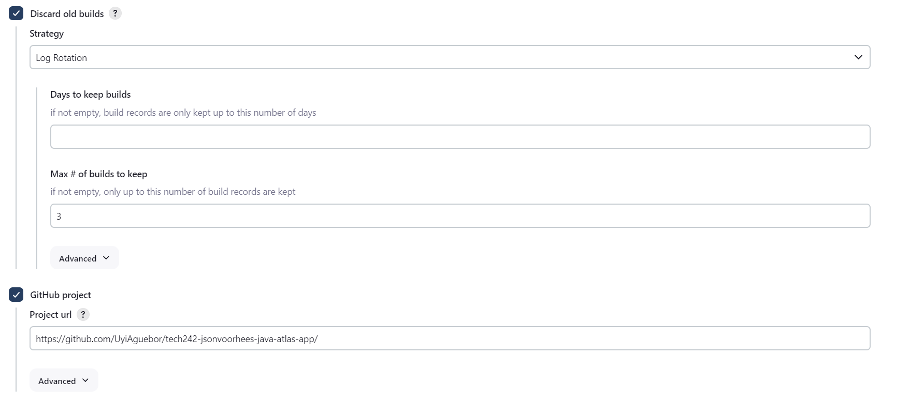
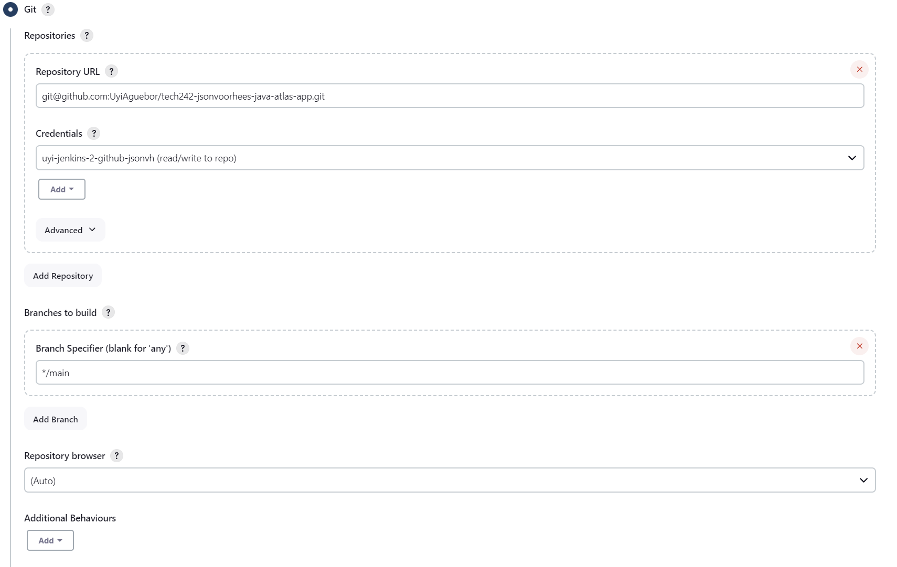
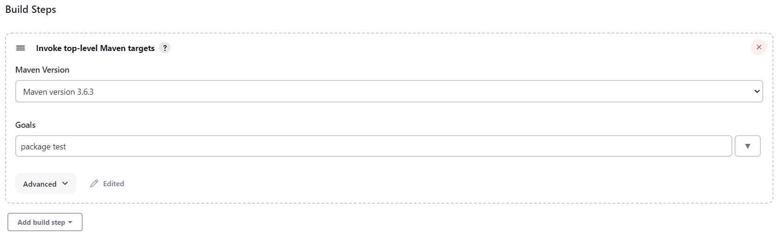

# Jenkins Pipeline

1. git push - trigger
2. gihub recieves the changes
3. github notifies Jenkins 
4. jenkins is listening (github tells when there is a change)

## Pipeline Structure

- Job 1 test code
- Job 2 merge dev
- Job 3 deploy

## Jenkins First Test Pipeline

1. Setup dev branch
2. Generate key pair in Bash terminal
3. Give github repo public key
4. Give jenkins private key
5. Connect to jenkins using EC2 link
6. Create a job
7. Select feelance
8. Select build steps and do execute shell
9. Type a command like `uname -a`
10. To make a pipeline go to Post-build Actions and select build other projects and select an existing project

## Job 1 test CI

1. Description
2. (Check) Discard old build and set the limit to 3
 
3. (Check) Github Project set to your repository link
4. Source Code management Git checked 
 
5. Build Steps
 
6. Add Trigger