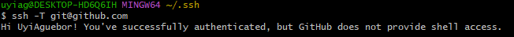

# Using SSH to push to GitHub

Aim: to set-up SSH to push to GitHub

## How we've been pushing to github 

Your Device ----HTTPS---> GitHub 

## SSH Key Pair

Algorithm used to generate the Key-Pair: RSA

Made up of:

- public key (PADLOCK) needs to be put on github
- private key (KEY) needs to be on your device

## Steps to setup GitHub SSH

1. Generate Key-Pair -> ssh-keygen -t rsa -b 4096 -C "email"

2. Register on GitHub

3. Add private key to SSH register eval `ssh-agent -s` ssh-add "key name"

4. Create a Test repo `ssh -T git@github.com`

5. Push to changes to test repo -> switch from HTTPS to SSH

6. On a new bash window we need to do the add private key commands 