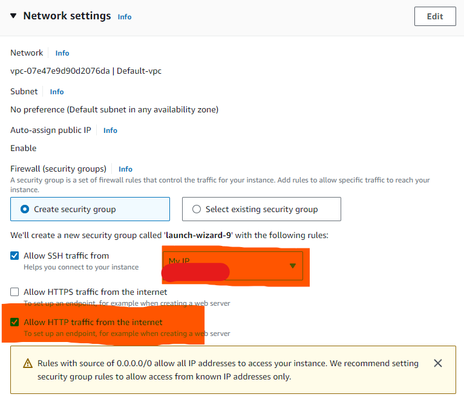

# EC2 instance - a virtual machine on AWS

## Parts of an EC2 instance (Virtual Machine in AWS)

- 1 region: where everything lives
- 2 VPC(determines region): like an apartment
- 3 Subnet: like a room inside a house
- 4 Elastic Network Interface: communicate with the computer through this
- 5 Elastic Block Store(persistant, can be used even if you destroy VM you can keep and use on another VM): stores the files
- 6 Virtual machine: like a computer/device within a room
- 7 Public IP: your public address
- 8 Private IP: secret address
- 9 Security group: like a security guard
- 10 inboud rules: what is allowed in
- 11 outbound rules: rules what allowed out
- 12 Amazon Machine Image (AMI):the files you wantr to start off with
- 13Key pair: like a padlock on the computer

# Creating an EC2 instance

## 1. Name 

## 2. Locating Amazon Machine Image: 
- look for more 
- Select "Community AMIs(500)"
- Search "20230424" and select the image ending in 1e9
  
Direct link: ubuntu/images/hvm-ssd/ubuntu-bionic-18.04-amd64-server-20230424 ami-0a7493ba2bc35c1e9

## 3. Instance Type
t2.micro
free for a certain amount of time in a month

## 4. Key Pair
Key Pair tech242

## 5. Network settings
Create security groups
- Edit "Security group name" and "Description"
- ssh and my IP
- Allow HTTP traffic from the internet

If youve created one simply select existing:
- My exiting is called tech242-uyi-allow-SSH-my-IP-HTTP

## 6.Then launch instance and connect 

"~/.ssh/tech242.pem"

## Security group
controls any sort of traffic comming in and out
particular services run on particular port(a way to connect to a particular service)
