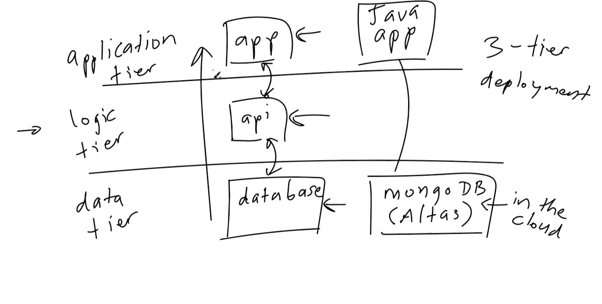

# Deployment

## Tiers of deployment
### 3 tier deployment 
1. application tier (app running)- usually what is presented to an end user.
2. logic tier (api interactions) - where the bussiness logic goes where things need to happen inbetween the app and database.
3. data tier (database running)- usually runs behind the appplication tier.

### If your using a database that is already running on the cloud
- If your using mongodb ytou dont have to deploy the database as its running in the cloud already so its a one tier deployment.

