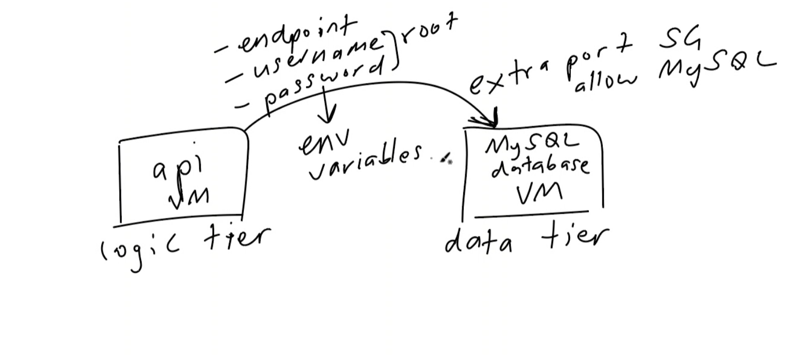

# 2 tier deployment

## What we need to do
- we need 2 VMs 
- api VM
- MySQL database
- connect through extra port with security group
- endpoint username and password need to be environment variables
- access these we use `${name}`
  
